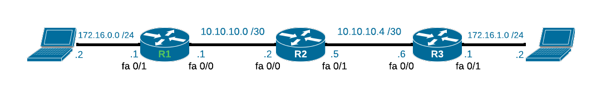
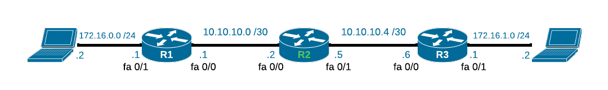
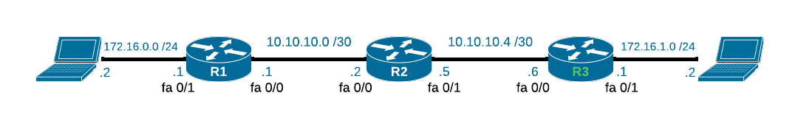

# OSPF

OSPF er en [`IGP`](/test.md) (Interior Gateway Protocol), som bruges til dynamisk routing.<br>

OSPF står for Open Shortest Path First, og er en af de mest brugte routing protokoller.<br>
Navnet er lidt misledende da det ikke er den fysiske korteste vej den vælger.<br>
Den vælger den vej der har den laveste `metric ` (omkostning).
Metric er en værdi der bliver beregnet sp ledes: [!badge text="båndbredde / interface hastighed" variant="ghost" ].<br>


OSPF er en link-state protokol, hvilket betyder at den sender information omkring alle sine naboer til alle andre routere i netværket.

Routerne ser sig selv som toppen af netværket, og alle andre routere er naboer til dem.
Her er et viruelt eksempel på det:
    
=== ":octicons-workflow-16: Topologi"

    ```mermaid
    flowchart LR
        1((("&nbsp;R1&nbsp;"))) --- 2((("&nbsp;R2&nbsp;")))
        style 1 stroke-width: 0px
        style 2 stroke-width: 0px
        2 --- 3((("&nbsp;R3&nbsp;")))
        style 3 stroke-width: 0px
    ```
=== ":octicons-x-circle-16: R1"
    ```mermaid
    flowchart TD
        1((("&nbsp;R1&nbsp;"))) --- 2((("&nbsp;R2&nbsp;")))
        style 1 fill:#99e2b4,stroke-width: 0px
        style 2 stroke-width: 0px
        2 --- 3((("&nbsp;R3&nbsp;")))
        style 3 stroke-width: 0px
    ```

=== ":octicons-x-circle-16: R2"
    ```mermaid
    flowchart TD
        1((("&nbsp;R2&nbsp;"))) --- 2((("&nbsp;R1&nbsp;")))
        style 1 fill:#99e2b4,stroke-width: 0px
        style 2 stroke-width: 0px
        1 --- 3((("&nbsp;R3&nbsp;")))
        style 3 stroke-width: 0px
    ```
=== ":octicons-x-circle-16: R3"
    ```mermaid
    flowchart TD
        1((("&nbsp;R3&nbsp;"))) --- 2((("&nbsp;R2&nbsp;")))
        style 1 fill:#99e2b4,stroke-width: 0px
        style 2 stroke-width: 0px
        2 --- 3((("&nbsp;R1&nbsp;")))
        style 3 stroke-width: 0px
    ```

Så det vil altså sige at R1 ser R2 og R3 som naboer, og R2 ser R1 og R3 som naboer osv.

Hver router har en `LSDB `(Link State Database), som er en liste over alle naboer og deres omkostninger.

Denne dtabase bliver formet af `LSAs` (Link State Advertisements), som er pakker der bliver sendt ud til alle naboer, og indeholder information omkring routeren der sender pakken.


## LAB Setup

 

### Plan

Vi skal konfigurere OSPF på alle routere, så de kan snakke sammen.<br>
I dette LAB bruger vi et single area, som er area 0.

Når vi er færsige med at konfigurere, skal vi verificere at det virker.<br>
Målet er at PC1 kan pinge PC2, og at PC2 kan pinge PC1.

### Konfiguration

=== ":octicons-x-circle-16: R1"
     
    
    ```js
    hostname R1
    !
    interface fastethernet 0/0
    ip address 10.10.10.1 255.255.255.252
    no shutdown
    !
    interface fastethernet 0/1
    ip address 172.16.0.1 255.255.255.0
    no shutdown
    !
    router ospf 1
    network 10.10.10.0 0.0.0.3 area 0
    network 172.16.0.0 0.0.0.255 area 0
    ```
=== ":octicons-x-circle-16: R2"
    
    ```js
    hostname R2
    !
    interface fastethernet 0/0
    ip address 10.10.10.2 255.255.255.252
    no shutdown
    !
    interface fastethernet 0/1
    ip address 10.10.10.5 255.255.255.252
    no shutdown
    !
    router ospf 1
    network 10.10.10.0 0.0.0.3 area 0
    network 10.10.10.4 0.0.0.3 area 0
    ```
=== ":octicons-x-circle-16: R3"
    
    ```js
    hostname R3
    !
    interface fastethernet 0/0
    ip address 10.10.10.6 255.255.255.252
    no shutdown
    !
    interface fastethernet 0/1
    ip address 172.16.1.1 255.255.255.252
    no shutdown
    !
    router ospf 1
    network 10.10.10.4 0.0.0.3 area 0
    network 172.16.1.0 0.0.0.255 area 0
    ```

### show ip route


For at verificere at det virker, kan vi bruge kommandoen `show ip route` på alle routere.

Her ville vi gerne se at alle routere har en rute til de andre routere, og at de har en rute til de to netværk.


=== ":octicons-x-circle-16: R1"
    
    ```js hl_lines="16-17"
    R1#show ip route 
    Codes: C - connected, S - static, I - IGRP, R - RIP, M - mobile, B - BGP
        D - EIGRP, EX - EIGRP external, O - OSPF, IA - OSPF inter area
        N1 - OSPF NSSA external type 1, N2 - OSPF NSSA external type 2
        E1 - OSPF external type 1, E2 - OSPF external type 2, E - EGP
        i - IS-IS, L1 - IS-IS level-1, L2 - IS-IS level-2, ia - IS-IS inter area
        * - candidate default, U - per-user static route, o - ODR
        P - periodic downloaded static route

    Gateway of last resort is not set

        10.0.0.0/30 is subnetted, 2 subnets
    C       10.10.10.0 is directly connected, FastEthernet0/0
    O       10.10.10.4 [110/2] via 10.10.10.2, 00:03:42, FastEthernet0/0
        172.16.0.0/24 is subnetted, 2 subnets
    C       172.16.0.0 is directly connected, FastEthernet0/1
    O       172.16.1.0 [110/3] via 10.10.10.2, 00:00:04, FastEthernet0/0
    ```
    På linje 16 og 17 kan vi se at R1 har en rute til de to netværk.<br>
    `C` betyder at det er en directly connected route til PC1s netværk. <br>
    `O` betyder at der er en OSPF route, over til PC2s netværk.

=== ":octicons-x-circle-16: R2"
    
    ```js hl_lines="16-17"
    R2#show ip route
    Codes: C - connected, S - static, I - IGRP, R - RIP, M - mobile, B - BGP
        D - EIGRP, EX - EIGRP external, O - OSPF, IA - OSPF inter area
        N1 - OSPF NSSA external type 1, N2 - OSPF NSSA external type 2
        E1 - OSPF external type 1, E2 - OSPF external type 2, E - EGP
        i - IS-IS, L1 - IS-IS level-1, L2 - IS-IS level-2, ia - IS-IS inter area
        * - candidate default, U - per-user static route, o - ODR
        P - periodic downloaded static route

    Gateway of last resort is not set

        10.0.0.0/30 is subnetted, 2 subnets
    C       10.10.10.0 is directly connected, FastEthernet0/0
    C       10.10.10.4 is directly connected, FastEthernet0/1
        172.16.0.0/24 is subnetted, 2 subnets
    O       172.16.0.0 [110/2] via 10.10.10.1, 00:10:20, FastEthernet0/0
    O       172.16.1.0 [110/2] via 10.10.10.6, 00:05:27, FastEthernet0/1
    ```

    På linje 16 og 17 kan vi se at R1 har en rute til de to netværk via OSPF.<br>
    `O` betyder at der er en OSPF route, over til PC1 og PC2s netværk.

=== ":octicons-x-circle-16: R3"
  
```js hl_lines="16-17"
R3#show ip route
Codes: C - connected, S - static, I - IGRP, R - RIP, M - mobile, B - BGP
       D - EIGRP, EX - EIGRP external, O - OSPF, IA - OSPF inter area
       N1 - OSPF NSSA external type 1, N2 - OSPF NSSA external type 2
       E1 - OSPF external type 1, E2 - OSPF external type 2, E - EGP
       i - IS-IS, L1 - IS-IS level-1, L2 - IS-IS level-2, ia - IS-IS inter area
       * - candidate default, U - per-user static route, o - ODR
       P - periodic downloaded static route

Gateway of last resort is not set

     10.0.0.0/30 is subnetted, 2 subnets
O       10.10.10.0 [110/2] via 10.10.10.5, 00:12:39, FastEthernet0/0
C       10.10.10.4 is directly connected, FastEthernet0/0
     172.16.0.0/24 is subnetted, 2 subnets
O       172.16.0.0 [110/3] via 10.10.10.5, 00:12:39, FastEthernet0/0
C       172.16.1.0 is directly connected, FastEthernet0/1
```
På linje 16 og 17 kan vi se at R1 har en rute til de to netværk.<br>
`O` betyder at der er en OSPF route, over til PC1s netværk.<br>
`C` betyder at det er en directly connected route til PC2s netværk. 

 

 I routing tabellen kan vi se [110/2] og [110/3], som er omkostningen til de to netværk.<br>
 `110` er OSPF cost, og `2` og `3` er omkostningen til de to netværk.<br>

### show ip ospf neighbor

For at verificere at OSPF virker, kan vi også bruge kommandoen `show ip ospf neighbor` på alle routere.

Denne kommnado vil vise os hvilke naboer vi har, og hvilken state de er i.


=== ":octicons-x-circle-16: R1"
     

    ```js hl_lines="16-17"
    R1#show ip ospf neighbor
    Neighbor ID     Pri   State           Dead Time   Address         Interface
    10.10.10.5        1   FULL/BDR        00:00:36    10.10.10.2      FastEthernet0/0
    ```
    Her kan vi se at R1 har et naboskab med R2, og at de er i state `FULL/BDR`.<br>
=== ":octicons-x-circle-16: R2"
     
    ```js hl_lines="16-17"
    R2#show ip ospf neighbor
    Neighbor ID     Pri   State           Dead Time   Address         Interface
    172.16.0.1        1   FULL/DR         00:00:35    10.10.10.1      FastEthernet0/0
    172.16.1.1        1   FULL/DR         00:00:34    10.10.10.6      FastEthernet0/1
    ```
    Her kan vi se at R2 har et naboskab med R1 og R3, og at de er i state `FULL/DR`.<br>
=== ":octicons-x-circle-16: R3"
     
    ```js hl_lines="16-17"
    R3#show ip ospf neighbor
    Neighbor ID     Pri   State           Dead Time   Address         Interface
    10.10.10.5        1   FULL/BDR        00:00:31    10.10.10.5      FastEthernet0/0
    ```
    Her kan vi se at R3 har et naboskab med R2, og at de er i state `FULL/BDR`.<br>


## Opsummering

Vi har nu konfigureret OSPF på alle routere, og verificeret at det virker.<br>

Det vi har konfigureret er et single area, hvilket betyder at vi kun har et area, nemlig `area 0`<br>
Dette bliver også kaldt et backbone area, da det er det primære område i et OSPF netværk.<br>

Man kan ikke have flere areas uden at have et `backbone area`, da alle andre areas skal være forbundet til `area 0`.<br>

 ## Packet Tracer
Som altid kan du downloade det færdige protjekt her: [OSPF-LAB1.pkt](downloads/OSPF-LAB1.pkt)

Se min [!badge Packet Tracer Starterguide](/Starterguide/pt.md)